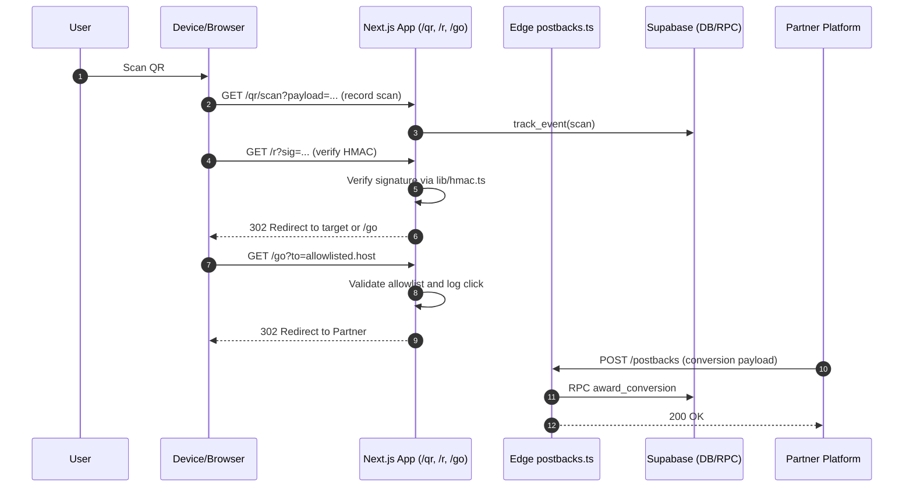
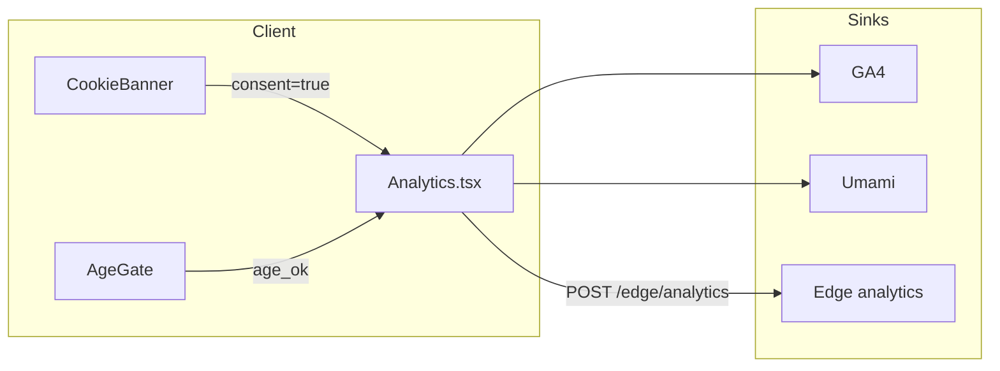
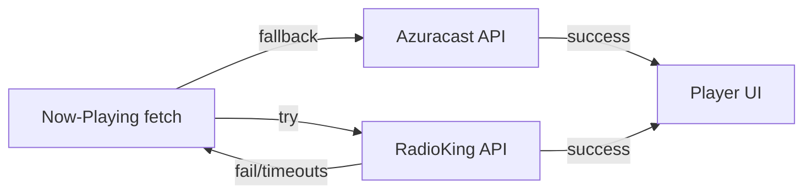
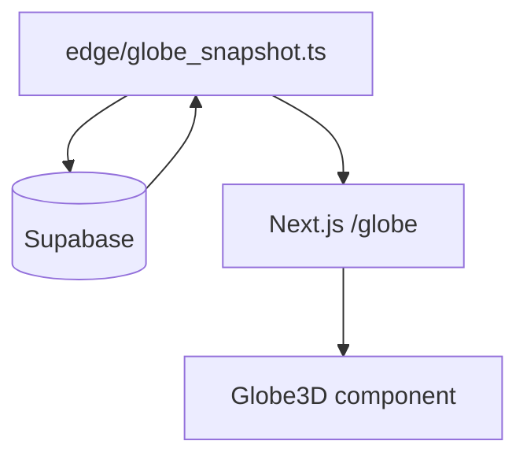
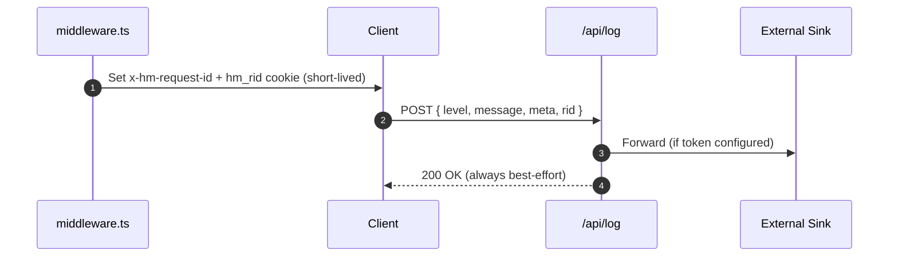

# Architecture Diagrams

This document provides high-level system context, data flows, and a folder graph for the HOTMESS Enterprise Next.js application.

Note: Diagrams use Mermaid and render on GitHub. Copy any diagram into mermaid.live to explore.

## 1) System Context (C4-style)

```mermaid
flowchart LR
  subgraph Client[Browser / Device]
    U[User]
    CB[CookieBanner / Consent]
    AG[AgeGateMenOnly]
    QR[RotatingQR]
    G3D[Globe3D]
    Axi[Analytics.tsx]
  end

  subgraph Next[Next.js 16 App (Vercel)]
    APPR[App Router: /, /radio, /shop, /care, /records, /earn, /rooms, /globe, /r, /go, /safe]
    API[/api/* routes]
    MW[middleware.ts (x-hm-request-id + hm_rid)]
  end

  subgraph Edge[Supabase Edge Functions]
    EPost[postbacks.ts]
    EAnal[analytics.ts]
    ETg[telegram.ts]
    EGlobe[globe_snapshot.ts]
    ESellers[sellers_submit.ts]
  end

  subgraph SB[Supabase]
    DB[(Postgres + RLS)]
    RPC[RPCs: track_event, award_conversion]
    Auth[Auth]
  end

  subgraph Third[Third-Party Services]
    RK[RadioKing]
    AZ[Azuracast]
    SF[Shopify Storefront]
    TG[Telegram]
    MK[Make.com]
    LOG[(Log sink: Logtail/Sentry)]
    GA[GA4]
    UM[Umami]
  end

  U -->|interacts| APPR
  APPR -->|server actions / API calls| API
  MW -. sets .-> U

  %% Data flows
  API -->|DB read/write| DB
  API -->|optional log forward| LOG
  APPR -->|consent true| Axi --> GA
  Axi --> UM
  Axi -->|edge ingest| EAnal
  EAnal --> DB

  %% Radio
  APPR --> RK
  APPR -->|fallback| AZ

  %% Globe
  APPR --> EGlobe --> DB
  EGlobe --> APPR

  %% QR / Affiliates
  APPR --> EPost --> RPC --> DB
  APPR --> SF
  APPR --> TG
  MK -. cron/webhooks .-> API
```

## 2) Folder Graph (Condensed)

```mermaid
flowchart TD
  root[(HOTMESS-NEXT)]
  subgraph app
    LAYOUT[layout.tsx]
    ERR[error.tsx + global-error.tsx]
    ROUTES[/radio|/shop|/care|/records|/earn|/rooms|/globe|/safe|/r|/go|/qr|/login|/legal]
    API[/api/*]
  end
  subgraph components
    UI[ui: button, card]
    CORE[AgeGate, CookieBanner, Analytics, Navbar, Footer]
    FEAT[RotatingQR, Globe3D, ConciergeWidget, WeatherStrip, StaggerViewport]
    CARDS[BlogCard, OfferCard, PartnerCard, DJCard, PromoCard, CampaignCard]
  end
  subgraph lib
    DATA[supabase*, shopify, radio, weather]
    SEC[hmac, crypto, links]
    OBS[log, retryFetch, rate, analytics, analyticsServer]
    TYPES[types, schemas/*, server/hmac]
  end
  subgraph edge
    postbacks
    analytics
    telegram
    globe_snapshot
    sellers_submit
  end
  subgraph scripts
    verify[verify.sh]
    env[env-doctor.sh, hm-env-sync.sh, validate-env.ts]
    sec[scan-secrets.sh, rotate-link-signing-secret.sh]
    links[sign-link.js, sign-go.js]
  end
  sql{{sql/*.sql: schema, RLS, RPC, marketplace, telegram, beacons}}
  tests[[__tests__: hmac, beacon-link, qr_api, go_route, telegram_webhook, a11y, points, StaggerViewport]]

  root --> app --> API
  root --> components
  root --> lib
  root --> edge
  root --> scripts
  root --> sql
  root --> tests
```

## 3) QR Affiliate Flow (Sequence)



## 4) Consent‑Gated Analytics



## 5) Radio Now-Playing with Fallback



## 6) Globe Snapshot



## 7) Logging & Correlation


