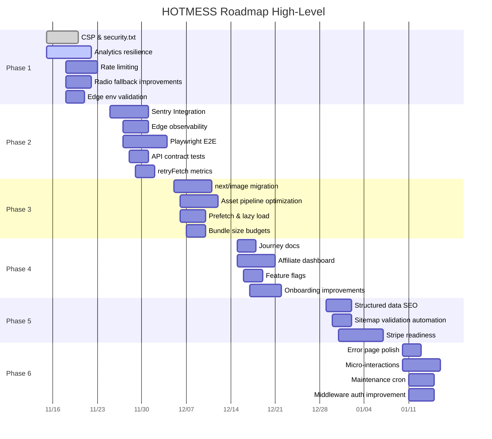

# Roadmap Priorities

This document orders the existing backlog into phased execution with rationale, dependencies, and acceptance criteria.

## Legend
- P#: Phase order (1 = earliest)
- Effort: S (small), M (medium), L (large)
- Impact: H (high), M, L (low)
- Dep: Key prerequisite(s)

## Phase 1 – Security & Core Resilience (Weeks 1–2)
| Item | Effort | Impact | Dep | Acceptance Criteria |
|------|--------|--------|-----|---------------------|
| Strict CSP + security.txt | M | H | none | `Content-Security-Policy` blocks inline scripts, only required domains; `/\.well-known/security.txt` served; manual test passes in browser devtools (no blocked essential assets). |
| Analytics resilience (buffer/offline) | M | H | consent gating | Events queued pre-consent; flushed post-consent; offline retry/backoff working (simulate offline). |
| Rate limiting (auth, analytics, log) | S | M | env doctor | 429 returned after threshold; counters reset per window; no severe perf regression. |
| Env validation (edge-only schema) | S | M | env doctor script | Missing edge secret fails verify gate; CI shows clear error; docs updated. |
| Improve radio fallback logic | S | M | retryFetch | RadioKing failure triggers Azuracast fetch; final failure surfaces user-friendly status component. |

## Phase 2 – Observability & Testing (Weeks 3–4)
| Item | Effort | Impact | Dep | Acceptance Criteria |
|------|--------|--------|-----|---------------------|
| Sentry integration (client + server) | M | H | structured logging, RID | Errors captured with request id correlation; source maps uploaded; sample rate adjustable. |
| Edge observability (timings + errors) | S | M | Sentry | Edge functions emit timing + status metrics (custom console tagging or ingest). |
| Playwright E2E flows | M | H | AgeGate, QR, radio fallback | Scripts pass in CI (headless); covers: age gate, consent gating, QR scan redirect (mock), radio fallback state, login redirect. |
| API contract tests (analytics, Telegram webhook) | S | M | env validation | Jest tests assert schema + error codes for invalid payloads. |
| retryFetch metrics/histogram | S | M | logging | Latency bucket log entries appear; final failure logs with cause classification. |

## Phase 3 – Performance & Assets (Weeks 5–6)
| Item | Effort | Impact | Dep | Acceptance Criteria |
|------|--------|--------|-----|---------------------|
| Migrate critical images to next/image | M | M | none | Largest images served WebP/AVIF, CLS unchanged, Lighthouse image audit improved. |
| Asset pipeline optimization | M | M | next/image | Unused SVGs removed; og.png compressed; build size delta documented. |
| Prefetch critical routes & lazy non-critical widgets | S | M | performance baseline | Home loads < X ms TTFB, interactive unaffected; network panel shows strategic prefetch. |
| Bundle size budgets + analysis script | S | M | build pipeline | CI fails if JS bundle exceeds set thresholds; analyze script snapshot committed. |

## Phase 4 – Product & User Insights (Weeks 7–8)
| Item | Effort | Impact | Dep | Acceptance Criteria |
|------|--------|--------|-----|---------------------|
| Structured user journey docs | S | M | E2E flows | Document maps to test IDs; updated when flows change. |
| Affiliate analytics dashboard (admin) | M | H | points, conversions | Admin page displays real-time conversions, CTR %, top partners; protected route. |
| Feature flags (env + Supabase table) | S | M | env doctor | Flag-enabled component toggles in staging; fallback disabled state safe. |
| Onboarding improvements (tooltips) | M | M | feature flags | First-session tooltips appear once; telemetry events captured, respecting consent. |

## Phase 5 – SEO & Commerce Expansion (Weeks 9–10)
| Item | Effort | Impact | Dep | Acceptance Criteria |
|------|--------|--------|-----|---------------------|
| SEO structured data (BreadcrumbList, richer metadata) | S | M | existing metadata.ts | JSON-LD validates (Google Rich Results); dynamic per route. |
| Sitemap validation automation | S | L | sitemap.ts | CI job asserts sitemap freshness + URL count matches routes. |
| Payment & commerce readiness (Stripe tests) | M | H | marketplace schema | Test checkout mock passes; webhook signature test asserts rejection on bad signature. |

## Phase 6 – Polish & Maintenance (Weeks 11–12)
| Item | Effort | Impact | Dep | Acceptance Criteria |
|------|--------|--------|-----|---------------------|
| Error page UX polish (500 recovery links) | S | M | error boundaries | 500 page actionable links + support contact visible; a11y test passes. |
| Micro-interactions (reduced-motion aware) | M | M | framer-motion | Animations skip when prefers-reduced-motion; no performance regressions. |
| Maintenance cron (secret rotation + stale link cleanup) | S | M | rotate script | GitHub Action/Supabase schedule executes; logs rotation event; stale links removed > TTL. |
| Middleware auth heuristic improvement | S | M | Supabase auth helpers | Middleware checks signed cookie/session; rejects tampered cookie. |

## Dependency Notes
- CSP early to avoid retrofitting allowances after third-party script sprawl.
- Sentry before deep E2E to provide debugging context.
- Feature flags precede onboarding experiments.
- Rate limiting precedes opening analytics ingest to higher event volumes.

## Acceptance Testing Strategy
- Each phase ends with: build + lint + typecheck + unit + E2E + coverage delta report.
- Security features validated via manual browser console (CSP), negative tests (tampered QR, blocked host). 

## Risk Mitigation
- Introduce flags for new analytics buffering to allow fallback to legacy direct-fire method.
- Keep a shadow logging path (console JSON) until external sink stable.
- Avoid premature asset optimization before stable layout (to reduce cache churn).

## Mermaid Gantt (High-Level)

## Monitoring of Progress
Use `PROGRESS.md` updates + CI workflow status badges (to be added) + coverage summary trend lines.

## CI Enhancements (Future)
- Job matrix: node versions (18, 20) optional.
- Separate workflow for scheduled secret rotation and stale link cleanup.

## Backlog That Can Slip (Lower Priority)
- Advanced performance budgets (bundle diff automation) beyond initial threshold alerts.
- Radio track history enrichment (album art fallback) if primary streaming stable.

---
Document maintained alongside `README.md`; update phases as tasks complete or reprioritized.
